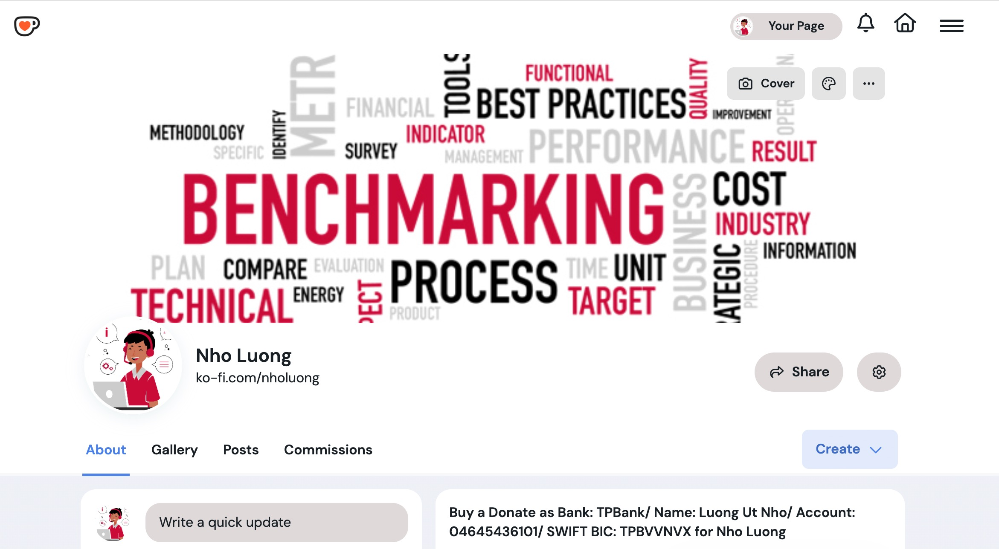

### [View all Roadmaps](https://github.com/nholuongut/all-roadmaps) &nbsp;&middot;&nbsp; [Best Practices](https://github.com/nholuongut/all-roadmaps/blob/main/public/best-practices/) &nbsp;&middot;&nbsp; [Questions](https://www.linkedin.com/in/nholuong/)
<br/>

# Blake2b
- Cryptographically compatible Blake2b
- If you have PHP >= 7.2 with [Sodium](http://php.net/manual/en/book.sodium.php), please use [`sodium_crypto_generichash()`](http://php.net/manual/en/function.sodium-crypto-generichash.php)

## Usage

```php
$blake2b = new Blake2b();
$hash = $blake2b->hash( 'Hello, world!' );
if( $hash !== hex2bin( 'b5da441cfe72ae042ef4d2b17742907f675de4da57462d4c3609c2e2ed755970' ) )
    exit( 1 );
```

## Requirements

- [PHP](http://php.net) >= 5.4

## Installation

Require through Composer:

```json
{
    "require": {
        "nholuongut/blake2b": "1.0.*"
    }
}
```


# I'm are always open to your feedback🚀
# **[Contact Me🇻]**
* [Name: Nho Luong]
* [Telegram](+84983630781)
* [WhatsApp](+84983630781)
* [PayPal.Me](https://www.paypal.com/paypalme/nholuongut)
* [Linkedin](https://www.linkedin.com/in/nholuong/)



[](https://ko-fi.com/nholuong)

# License🇻
* Nho Luong (c). All Rights Reserved.🌟
